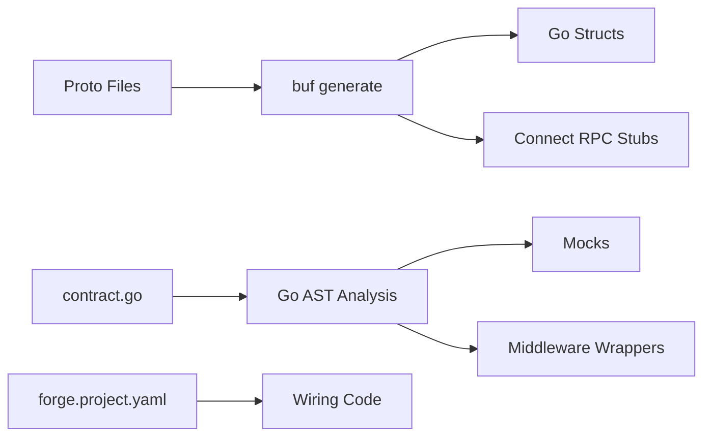

# Code Generation

Forge generates code from proto files and Go interface contracts, producing Connect RPC stubs, mocks, middleware wrappers, and dependency wiring.

## Generation Pipeline



## Command

```bash
# Generate all code
forge generate

# Watch mode
forge generate --watch
```

## Generation Steps

1. **`buf generate`** — Proto messages + Connect RPC stubs into `gen/`
2. **`buf generate`** — TypeScript stubs for Next.js frontends (if any)
3. **Service stubs** — `service.go` for new services (non-destructive)
4. **Mock generation** — Mocks for API services and internal packages
5. **Middleware wrappers** — Logging/tracing wrappers for internal packages
6. **Wiring code** — `pkg/app/wire.go` with construction logic
7. **`sqlc generate`** — If `sqlc.yaml` exists
8. **`go mod tidy`** — In `gen/`

## Generated Code Structure

```
gen/
├── go.mod
├── services/
│   └── users/v1/
│       ├── users.pb.go             # Proto messages
│       └── usersv1connect/
│           └── users.connect.go    # Connect RPC stubs
└── forge/options/v1/
    └── options.pb.go               # Proto option definitions

pkg/app/
├── wire.go                         # GENERATED — dependency construction
├── wire_test.go                    # GENERATED — test wiring
└── testing.go                      # GENERATED — test helpers

services/mocks/
└── users_service_mock.go           # Generated mock

internal/<name>/
├── mock_gen.go                     # Generated mock from contract.go
└── middleware_gen.go               # Generated logging/tracing wrapper
```

## Contract Enforcement

The `forge lint --contract` command enforces that all exported methods match their contracts:

- For proto API services: methods must correspond to proto RPCs
- For internal packages: methods must be in the `contract.go` interface

```bash
forge lint --contract
forge lint --contract ./services/users
```

## Proto Conventions

### Package Naming

```protobuf
package services.users.v1;

option go_package = "github.com/myorg/myapp/gen/services/users/v1;usersv1";
```

### Service Definitions

```protobuf
service UsersService {
  rpc CreateUser(CreateUserRequest) returns (CreateUserResponse);
  rpc GetUser(GetUserRequest) returns (GetUserResponse);
}
```

## Buf Configuration

`buf.yaml`:
```yaml
version: v2
modules:
  - path: proto
    name: buf.build/myorg/myapp

lint:
  use:
    - STANDARD

breaking:
  use:
    - FILE
```

## Regeneration

Code is regenerated when:
- Proto files change (via `--watch`)
- Running `forge generate`
- After `forge add service` or `forge package new`

## Best Practices

1. **Proto-first for APIs** — Always define services in `.proto` before implementing
2. **Interface-first for internals** — Define `contract.go` before implementing
3. **Versioning** — Use `/v1`, `/v2` in proto package names
4. **Commit generated code** — Makes builds reproducible
5. **Use buf** — Leverage buf's linting and breaking change detection

## See Also

- [Proto Conventions]()
- [Creating Services]()
