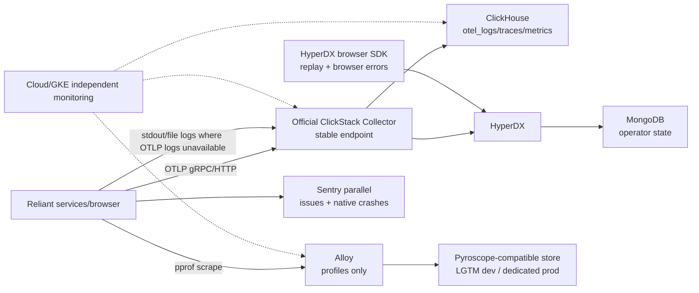
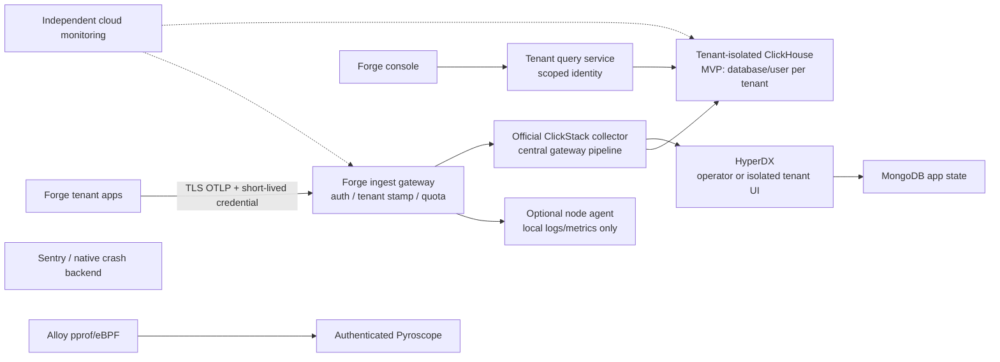
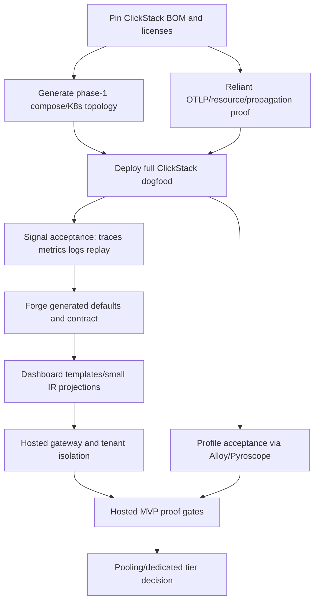

# Forge observability: revised architecture

**Status:** revised, accepted for implementation (phase 1 decisions are settled)
**Date:** 2026-10-08
**Scope:** Forge defaults, Reliant dogfood, then hosted Forge users. This is a design/roadmap document; it does not edit source code.

## Decision summary

Forge will make telemetry work by default without coupling applications to a backend. Applications emit OTLP to a stable, generated endpoint; the official ClickStack collector owns the logs/traces/metrics ClickHouse schema. Phase 1 uses the **official full ClickStack distribution** (ClickHouse, HyperDX, ClickStack collector, Mongo) in local development and Reliant production dogfood. HyperDX and Mongo are operator-only in dogfood: they are not a tenant boundary and are not exposed as a customer-facing control plane. This is deliberately more expensive than the operations report's ClickHouse-only recommendation, because the acceptance target includes validating HyperDX correlation and browser replay. The ClickHouse-only topology remains a valid lower-cost fallback if the measured dogfood burden is unacceptable, but is not the chosen validation path.

Phase 1 does **not** add a Forge gateway in front of the collector. A generated stable collector Service/compose name is enough for one trusted Reliant tenant. A gateway becomes mandatory before hosted multi-tenancy: it authenticates, maps credentials to tenant identity, removes client tenant selectors, stamps trusted identity, applies quotas, and routes to isolated storage. Apps never select a database or send ClickHouse credentials.

Profiles remain a separate signal: Alloy collects pprof (and optional eBPF where permitted) and writes to Pyroscope. OTLP Profiles are experimental and are not written to ClickHouse. Sentry remains for issue lifecycle and native/Electron crashes while ClickStack captures correlated errors and browser replay. No claim is made that ClickStack replaces Sentry, stores profiles, or provides a stable dashboard/alert API.

## Topology

### Phase 1: local and Reliant dogfood



The collector is the official ClickStack distribution, not an assumed upstream contrib exporter. Pin its image and component manifest. Collector pipelines must not duplicate a signal: OTLP logs are authoritative where emitted; file/stdout collection is a compatibility path for processes that cannot emit logs, with a documented exclusion/deduplication rule. Metrics scraped by Collector are authoritative for services without OTLP metrics; do not also scrape the same endpoint with Alloy.

### Eventual hosted path



Pooling is deferred. The hosted MVP boundary is deployment/database/cluster isolation, not HyperDX teams or a client-supplied `tenant.id`. A tenant may receive a dedicated service/cluster later; the gateway contract remains unchanged.

## Signal matrix

| Signal | Producer and authoritative path | Phase 1 storage/query | Hosted MVP | Explicit non-claim |
|---|---|---|---|---|
| Traces | Forge/OTel SDK -> official ClickStack collector OTLP | ClickHouse `otel_traces`; HyperDX waterfall/search | Gateway -> isolated ClickHouse; Forge query service/HyperDX | Not Tempo-compatible by promise; schema is pinned ClickStack schema |
| Metrics | OTLP metrics or one Collector Prometheus scrape, never both | ClickHouse metric tables; Prometheus `/metrics` remains a local health/debug surface | Gateway -> ClickHouse; independent platform metrics for meta-monitoring | No promise of PromQL semantics |
| Logs | Structured stdout/file compatibility collector, plus OTLP logs as SDK support lands | ClickHouse `otel_logs`; HyperDX search/live tail | Gateway -> ClickHouse with redaction and quotas | “All logs” is false unless a source is configured and tested |
| Browser replay | Pinned HyperDX browser SDK -> HyperDX replay ingestion/API, with CSP and masking | HyperDX/ClickHouse session tables as supported by pinned release | Gateway or isolated HyperDX path; tenant-scoped access | Replay is not ordinary OTLP and transport API is version-sensitive |
| Profiles | Alloy pprof scrape (sidecar/loopback proxy), optional privileged eBPF -> Pyroscope | Pyroscope-compatible backend; manual pprof remains break-glass | Authenticated Pyroscope, tenant labels from workload identity | ClickStack/HyperDX does not provide a verified profiles store/UI; OTLP Profiles are alpha |
| Errors/crashes | OTel exception events + error logs to ClickStack; Sentry receives parallel errors; Electron/native crash SDK remains Sentry | ClickHouse/HyperDX for correlated search; Sentry for issue lifecycle/native crashes | Same split until parity review | ClickStack is not a Sentry replacement today |

## Security and tenancy

Phase 1 is internally single-tenant. Collector and ClickHouse are private network services; HyperDX/Mongo admin interfaces are operator-only; OTLP uses TLS/auth where traffic leaves a trusted local network; pprof is loopback or protected by an in-pod sidecar. Secrets are deployment-managed, never generated into app source or telemetry.

Before hosted tenants, the gateway must:

1. Validate a short-lived credential (OIDC/service token or mTLS), map subject to an immutable tenant record, and reject unknown/revoked credentials.
2. Delete client `tenant.id`, routing, database, and equivalent selectors; stamp canonical tenant identity from authenticated context. `service.name` and resource identity are validated/normalized, not used as authorization.
3. Issue and rotate collector/query credentials, maintain revocation and audit records, and avoid returning ClickHouse passwords through HyperDX/Mongo APIs.
4. Enforce byte/event/attribute/cardinality limits, bounded collector queues, ClickHouse settings profiles/quotas, and per-signal retention. Debug data is droppable; security/audit data is not silently dropped.
5. Use separate database/user per tenant for the MVP. If pooling is proposed later, require server-side identity-bound row policies on every local table, shard/Distributed/materialized-view path, query fuzzing, forged-attribute tests, noisy-neighbor tests, deletion tests, external security review, and a signed version-pinned threat assessment.
6. Delete tenant data from hot tables, replicas, materialized views, HyperDX/Mongo state, Pyroscope, exports, backups, caches, and credentials; provide an auditable completion record. TTL is retention, not instant legal erasure.

## Declarative Forge contract

The contract is backend-neutral and uses working defaults, not a mode enum. A project declares policy; Forge projects dev/compose/Kubernetes/hosted deployments from the same typed values.

```yaml
observability:
  enabled: true
  service_name: auto                 # workload name when omitted
  service_version: auto              # build/release metadata
  environment: auto                  # generated environment
  endpoint: auto                     # generated stable OTLP endpoint
  protocols: [grpc, http]            # generated collector listeners
  signals: [traces, metrics, logs, browser_replay, profiles, errors]
  sampling:
    traces: auto
    errors: always
    slow_traces: always
    logs_success: auto
  redaction:
    preset: strict
    fields: []                        # user-owned additions
  retention:
    traces: 7d
    metrics: 30d
    logs: 14d
    replay: 3d
    profiles: 7d
  profiles:
    provider: pyroscope
    pprof: true
    ebpf: auto
  errors:
    sentry_parallel: true
  dashboards:
    defaults: true
    overrides: observability/dashboards/
  alerts:
    defaults: true
    overrides: observability/alerts/
```

Exact implementation types belong in Forge's typed KCL/config schema: `ObservabilityConfig`, `ObservabilitySampling`, `ObservabilityRetention`, `ObservabilityProfiles`, and `ObservabilityErrorPolicy`. `endpoint: auto` resolves to a compose service or cluster Service; explicit endpoint/auth overrides remain available. User config can add processors, exporters, redaction fields, retention, sampling, dashboard panels, and alerts without replacing generated wiring. Generated files own only derived compose/KCL/collector inputs; users own override directories and values. Generated app code must continue to use the stable OTLP contract.

Migration: `_observability: bool` maps `true` to `observability.enabled: true` and `false` to an explicit disabled policy with a warning; no silent loss. Legacy LGTM settings map only where semantics are equivalent. Existing Alloy profile settings are preserved as profile projections. A migration report calls out unsupported Loki/Tempo/Mimir dashboard queries rather than pretending JSON is import-compatible.

## Dashboards and alerts

Do not make HyperDX's unstable API the source of truth. Forge should first retain repo-owned JSON/query templates for the current Grafana path and introduce a small semantic IR only for concepts Forge guarantees: `service`, `environment`, `signal`, `query`, `threshold`, `window`, `severity`, and links carrying trace/span IDs. It should not model every vendor panel feature.

Generated defaults and user-owned overrides are separate files. A renderer can project the small IR to current Grafana JSON and, experimentally, to a pinned HyperDX dashboard/monitor API. A failed HyperDX projection is visible at generation/deploy time; the IR remains usable for Forge console/ClickHouse SQL. If experimentation shows templates are sufficient, keep templates and do not grow the IR. No alert API, import/export, revision semantics, or variable compatibility is promised until tested against the pinned release.

## Operations, versions, and cost

Pin a release manifest containing ClickStack, collector, ClickHouse, HyperDX, Mongo, Alloy, and Pyroscope image digests; record the collector component BOM and licenses/NOTICE. Do not infer compatibility from floating `latest`, current compose defaults, or component licenses. Legal review must cover the exact bundled image and hosted terms; the old proposal's resale certainty is removed.

Upgrade policy: canary the collector first; test schema/query/dashboard/replay/profile/error contracts; upgrade ClickHouse with format-compatible rollback only; take a backup before stateful upgrades; canary HyperDX/Mongo migrations; retain the previous image and config for fix-forward rollback. Rollback means image/config rollback when storage format permits, otherwise restore to isolated ClickHouse/Mongo/Pyroscope and cut over. Back up ClickHouse and Mongo to a separate encrypted object-storage project, retain manifests, and perform restore checksums/counts quarterly. Meta-monitoring is independent of ClickStack: collector drop/queue age, ClickHouse inserts/queries/parts/merges/disk, HyperDX/Mongo health, Pyroscope write failures, backup age, and gateway auth/quotas.

Planning assumptions, not commitments: current measured access logs are about 190 B/RPC (`control-plane/deploy/kcl/prod/config.k`); the research scenario estimates roughly 251.7 GB/month raw across all signals before attributes. Measure Reliant traffic, encoded bytes, compression, replay/profile volume, CPU/RAM, and query p95 in phase 1. Start dogfood ClickHouse single-node with durable PVC and object backup; it is not HA. Promote to 2–3 replicas plus Keeper only after measured availability requirements and restore drills justify the cost. HyperDX/Mongo add memory, persistent storage, upgrade and security burden; they are accepted in phase 1 solely to validate replay/UI, not as a cost-saving choice.

## Roadmap and dependency DAG



Disjoint work units:

| Unit | Repo/file boundary | Depends on |
|---|---|---|
| BOM/release harness | new observability manifest/docs under `forge/docs` and deployment-owned config | none |
| Reliant dogfood instrumentation | `reliant/internal/observability/`, startup tests, compose/deployment inputs | BOM |
| ClickStack deployment | `control-plane` observability deployment/KCL/Helm boundary; no Forge library files | BOM |
| Profile path | `control-plane/deploy/alloy-config.alloy`, Pyroscope values and Reliant pprof sidecar boundary | BOM |
| Forge contract | `forge/kcl/base.k`, typed config, templates and focused generation tests | dogfood proof |
| Dashboard projection | Forge proposal-owned templates/IR and control-plane dashboard inputs | contract + schema proof |
| Hosted gateway | control-plane gateway/auth/quota/tenant DB boundary | dogfood signals |
| Security/DR tests | isolated integration harness and deployment tests | gateway + storage |

The first implementable slice is **local full ClickStack plus a single Reliant workload**, followed by production dogfood. Acceptance tests: known trace/metric/log are queryable with real service/resource/trace IDs; browser exception, trace propagation, replay masking and CSP work; HyperDX search/waterfall works; Sentry receives the parallel error; collector outage has bounded queues and no application crash; Alloy retrieves a pprof profile without port-forward through the chosen sidecar; ClickHouse backup restores; independent meta-alert fires when ingestion is stopped. Keep current LGTM/Grafana as rollback until these pass.

## Failure modes and recovery

- Collector unavailable: app exporters retry with bounded queues; health/no-data alert fires; low-value logs may drop, errors/audit signals are prioritized; restore collector before replaying disk queues.
- ClickHouse unavailable/full: bounded persistent queues, backpressure and ingestion shedding; never OOM the app; restore from backup or replace node, then replay within retention.
- HyperDX/Mongo unavailable: telemetry remains in ClickHouse; operator query falls back to SQL; restore Mongo separately; this is not an ingest dependency claim unless the pinned SDK proves otherwise.
- Alloy/Pyroscope unavailable: retain pprof break-glass access and report profile loss; traces/logs/metrics continue through ClickStack.
- Credential compromise: revoke token, rotate mapped credentials, isolate tenant, audit access, and run deletion/incident procedure.
- Schema/API upgrade break: stop rollout, restore prior compatible image/config, or restore state and fix forward; never mutate production tables blindly.

## Alternatives rejected

- **ClickHouse-only phase 1:** cheaper and simpler, but fails the explicit HyperDX/replay validation objective; retained as fallback, not selected.
- **Forge gateway in phase 1:** unnecessary single-tenant hop and new failure mode; mandatory before hosted tenants.
- **Replace Alloy entirely:** wrong because profiles use Alloy/Pyroscope while ClickStack lacks verified profile support. Alloy is removed only from duplicate logs/metrics pipelines.
- **Custom profile tables in ClickHouse:** profile protocol/backend/UI are alpha and unverified; defer.
- **Pooled tenancy by default:** HyperDX team scope is not ClickHouse isolation; defer behind proof gates.
- **Immediate Sentry replacement:** no verified issue lifecycle, source-map, release-health, or native crash parity.
- **Huge dashboard abstraction:** vendor APIs are unstable; use templates plus a deliberately small IR only if two projections require it.

## Owner decisions still open (not phase-1 blockers)

- Which exact pinned ClickStack release/digests and supported ClickHouse/collector matrix pass the BOM and replay tests?
- Reliant production dogfood retention/sampling budgets after measured volume.
- Whether hosted MVP uses self-hosted ClickHouse/HyperDX or managed ClickHouse/HyperDX after six-month TCO and residency review.
- Whether Forge console ships before or after experimental HyperDX API projection.
- External security review scope/timing and the proof threshold for any future pooling.
- Long-term error issue lifecycle ownership and whether Sentry remains the native-crash system permanently.

## Sources

The design evidence summarized here is retained in this proposal rather than depending on session-only research artifacts. Existing implementation references: `forge/pkg/observe/setup.go`, `forge/internal/templates/project/docker-compose.yml.tmpl`, `forge/internal/templates/project/alloy-config.alloy.tmpl`, `forge/kcl/base.k`, `reliant/internal/observability/tracing.go`, `reliant/internal/serverapi/run.go`, `reliant/internal/servergateway/run.go`, `control-plane/deploy/alloy-config.alloy`, `control-plane/deploy/observability/`. Official sources include [ClickStack architecture](https://clickhouse.com/docs/clickstack/architecture), [ClickStack schemas](https://clickhouse.com/docs/clickstack/ingesting-data/schemas), [ClickStack deployment](https://clickhouse.com/docs/clickstack/deployment/docker-compose), [HyperDX browser SDK](https://www.hyperdx.io/docs/install/browser), [HyperDX dashboards API](https://www.hyperdx.io/docs/api/dashboards), [ClickHouse access control](https://clickhouse.com/docs/concepts/features/security/access-rights), [ClickHouse row policies](https://clickhouse.com/docs/sql-reference/statements/create/row-policy), [OTel resiliency](https://opentelemetry.io/docs/collector/resiliency/), [OTel Profiles](https://opentelemetry.io/docs/concepts/signals/profiles/), [Profiles alpha](https://opentelemetry.io/blog/2026/profiles-alpha/), [Alloy Pyroscope](https://grafana.com/docs/alloy/latest/reference/components/pyroscope/pyroscope.ebpf/), and [ClickHouse Profiles status](https://clickhouse.com/resources/engineering/otel-news-profiles-signal).
